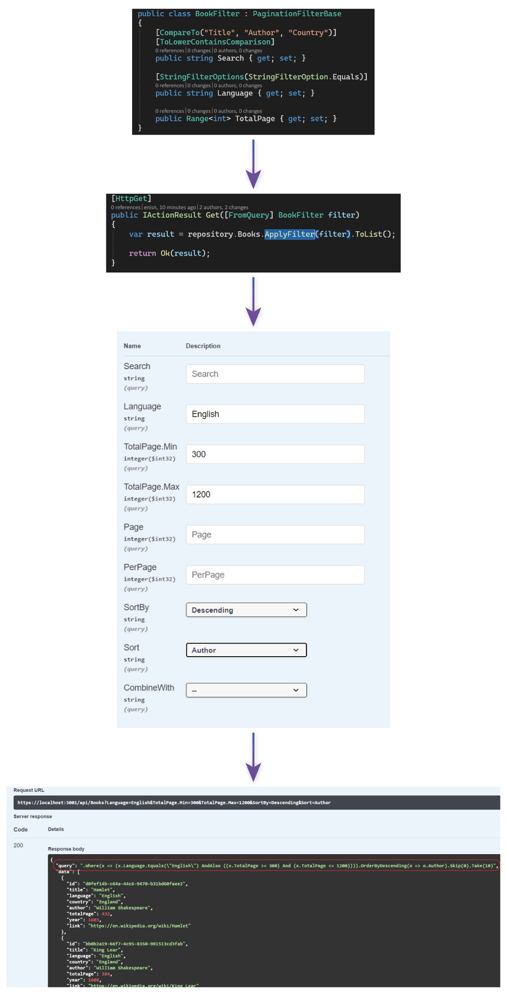

<table>
<tr>
<td width="15%">

  

</td>
<td>

 # AutoFilterer

AutoFilterer is a mini filtering framework library for dotnet.
The main purpose of the library is to generate LINQ expressions for Entities over DTOs automatically. Creating queries without writing any expression code is the most powerful feature that is provided. The first aim of AutoFilterer is to be compatible with Open API 3.0 Specifications, unlike oData & GraphQL.

> This library **does not** generate database queries directly. It generates LINQ Expressions.

You can visit [Wiki](../../wiki) for documentation

[](https://www.nuget.org/packages/AutoFilterer/)
[](../../wiki)
[](https://www.codefactor.io/repository/github/enisn/autofilterer)
<a href="https://codeclimate.com/github/enisn/AutoFilterer/maintainability"></a>
[](https://ci.appveyor.com/project/enisn/autofilterer)
<a href="https://gitmoji.carloscuesta.me">
  
</a>
</td>
</tr>
</table>

## Getting Started

- Install `AutoFilterer` NuGet package from [here](https://www.nuget.org/packages/AutoFilterer/).

Vsit [visit documentation](../../wiki) to learn how to use AutoFilterer.

[](https://open.vscode.dev/enisn/AutoFilterer)
***

## Showcase

<a href="https://autofilterer-showcase.herokuapp.com/swagger/index.html#/Books/get_api_Books" target="_blank">TRY LIVE DEMO</a> now.



***

## Usage
A quick example is presented below. Reading [Wiki](../../wiki) is highly recommended for detailed features.

- Create a filter model and make sure property names match to Entity properties.

```csharp
public class ProductFilter : PaginationFilterBase
{
  public Range<double> Price { get; set; }

  [ToLowerContainsComparison]
  public string Name { get; set; }
  
  [StringFilteringOptions(StringFilterOption.Equals)]
  public string Locale { get; set; }
}
```

```csharp
  public IActionResult GetProducts([FromQuery]ProductFilter filter)
  {
    var products = db.Products.ApplyFilter(filter).ToList();
    return Ok(products);
  }
```

Don't forget to [visit Wiki](../../wiki) for better understanding of usage.

***

## AutoFilterer.Swagger
All parameters support OpenAPI 3.0 Specifications 👍

Improve your swagger documentation via using [AutoFilterer.Swagger](https://github.com/enisn/AutoFilterer/tree/master/src/AutoFilterer.Swagger)

***

## AutoFilterer.Generators
AutoFilterer.Generators aims to generate filter objects from entities automatically via using [dotnet source generators](https://devblogs.microsoft.com/dotnet/introducing-c-source-generators/). 

Visit [documentation of Generators](docs/generators/AutoFilterer-Generators.md)

---

## Performance

See Benchmark Results from [here](docs/Benchmark-Results.md)

---

## Stats


